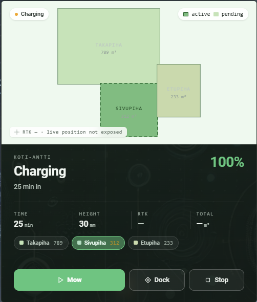

# PapaDog's Anthbot Genie Card

[](https://github.com/hacs/integration)

A map-led [Home Assistant](https://www.home-assistant.io/) Lovelace card for the
**Anthbot Genie** robot mower. It renders your real mowing zones as a yard map,
glows the zone currently being mowed, shows honest coverage
(`mowing_area / map_area`), battery, RTK state and session stats, and exposes
Pause / Resume / Dock / Stop / per-zone-start controls.



> **Requires the [`anthbot_genie_ha`](https://github.com/vincentjanv/anthbot_genie_ha)
> integration by [@vincentjanv](https://github.com/vincentjanv).** Install and
> configure that first. This card only *visualizes* the entities that integration
> exposes — all of the device discovery, cloud communication and credit for the
> hard part belong to that project. Thank you to its author.

## Disclaimer

This is a **personal hobby project**, not affiliated with or endorsed by Anthbot
or by the `anthbot_genie_ha` integration. It is provided **as is**, with **no
warranty and no guarantee of fitness, correctness, or that it works at all**. The
author accepts **no liability** for any damage, data loss, lawn damage, unexpected
mower behaviour, or any other consequence arising from its use. Use it entirely at
your own risk. See [LICENSE](LICENSE) for the full terms.

## Requirements

- Home Assistant 2024.4.0 or newer.
- The [`anthbot_genie_ha`](https://github.com/vincentjanv/anthbot_genie_ha)
  integration installed, configured, and exposing at least a `lawn_mower.*`
  entity for your mower.

## Installation

### HACS (recommended)

1. In Home Assistant, open **HACS**.
2. Open the three-dot menu → **Custom repositories**.
3. Add `https://github.com/jnaatanen/pd-anthbot-genie-card` with category
   **Lovelace** (dashboard).
4. Install **PapaDog's Anthbot Genie Card**. HACS adds the dashboard resource
   for you.

### Manual

1. Copy `anthbot-genie-card.js` into `/config/www/`.
2. **Settings → Dashboards → ⋮ → Resources → Add** `/local/anthbot-genie-card.js`
   as a **JavaScript Module**.
3. Add the card to a dashboard (see `examples/lovelace.yaml`).

## Configuration

```yaml
type: custom:anthbot-genie-card
entity: lawn_mower.<your_mower>      # your mower's lawn_mower entity
# optional:
variant: expanded                   # compact | expanded   (default expanded)
show_dock: true
invert_y: false                     # set true if the yard renders upside-down
preferred_services: lawn_mower      # lawn_mower | anthbot_genie
meters_per_unit: 0.001              # zone vertices are local mm → m (for area labels)
error_labels:                       # optional code → label map for the error state
  "12": Blade jammed
entities:                           # optional explicit overrides (rarely needed)
  battery_level: sensor.<your_mower>_battery_level
```

`entity` is the only required option. Everything else auto-resolves.

> **Multiple mowers:** add **one card per mower**, each with its own `entity`.
> The card scopes its map, zones, stats and controls to that mower (by its
> `serial_number`), so two cards sit side by side without their zones drawing
> on top of each other. See example 4 below.

| Option | Default | Notes |
| --- | --- | --- |
| `entity` | — | The `lawn_mower.*` entity. **Required.** |
| `variant` | `expanded` | `compact` (380px) or `expanded` (480px). |
| `show_dock` | `true` | Draw the dock marker when coordinates are available. |
| `invert_y` | `false` | Flip the Y axis if the map is upside-down. |
| `preferred_services` | `lawn_mower` | Use the `lawn_mower` platform services (Pause/Resume/Mow/Dock) where they exist, falling back to `anthbot_genie.*` for Stop and zone starts. |
| `meters_per_unit` | `0.001` | Scale factor from zone vertex units to metres, used for the computed per-zone area labels. The Genie reports millimetres. |
| `error_labels` | `{}` | Map an `error_code` value to a human label for the error state. |
| `entities` | `{}` | Explicit entity-id overrides, keyed by logical name (`battery_level`, `map_area`, `rtk_state`, `zones`, `charging`, `connection`, `position`, …). |

## How it finds your entities

The `anthbot_genie_ha` integration names its entities after each mower's **device
alias** (e.g. `sensor.<your_mower>_battery_level`), and a single Home Assistant
instance may have **several mowers**. So the card does **not** assume a fixed
`sensor.anthbot_genie_*` id scheme. Instead it:

1. reads the configured mower's `serial_number` attribute, then
2. finds the sibling sensors/buttons carrying the **same `serial_number`**,
   identifying each by its registry `translation_key` (or entity-id slug).

This scopes everything to the right mower. If resolution finds nothing (e.g. a
custom setup), it falls back to literal `*.anthbot_genie_*` ids, and you can
always pin ids explicitly with the `entities:` option.

Zone polygons are discovered the same way: any `button.*` belonging to this
mower that carries a `vertexs`/`points` array.

## Theming

The card reads Home Assistant theme variables first (so it follows light/dark
themes automatically) and exposes its own `--ag-*` tokens as overridable hooks.
It works well with [card-mod](https://github.com/thomasloven/lovelace-card-mod).

The example below produces a dark "glass" look with a green accent: a dark body
with light text, the map kept light with dark/readable overlays, and a clearly
highlighted active zone.

```yaml
type: custom:anthbot-genie-card
entity: lawn_mower.<your_mower>
variant: expanded
card_mod:
  style: |
    ha-card {
      background: linear-gradient(160deg, rgba(19,36,28,0.93), rgba(12,22,17,0.95));
      border: 1px solid rgba(255,255,255,0.08);
      box-shadow: 0 14px 34px -16px rgba(0,0,0,0.7);
      --ag-accent: #34c77b;          /* battery %, Mow button, mowing dot */
      --ag-fg: #eef5f0;              /* light base text for the dark body */
      --ag-muted: #b9ccc0;
      --ag-faint: #93a79b;
      --ag-border: rgba(255,255,255,0.12);
      --ag-border-strong: rgba(255,255,255,0.22);
      --ag-surface: rgba(255,255,255,0.05);
    }
    /* the big state word inherits its colour from the card → set it explicitly */
    .state { color: #eef5f0; }
    /* the map stays light → force its overlay text dark so it reads */
    .map .badge, .map .legend { color: #16241d; background: rgba(255,255,255,0.92); }
    .map .pos-state { color: #44584c; background: rgba(255,255,255,0.85); }
    /* active zone chip: readable green */
    .zone-strip .zone.active { background: rgba(52,199,123,0.5); border-color: #34c77b; color: #eafff4; }
```

Tip: raise the two background `rgba(...)` alpha values for a more opaque panel,
or lower them for a glassier look over your dashboard background.

## Reserved slots (light up when the integration exposes them)

These render graceful empty states today and need **zero card changes** to
activate:

| Add to the integration | Lights up |
| --- | --- |
| `sensor.<mower>_position` with `x`, `y` attrs | Live mower dot inside the active zone |
| …plus `heading` (deg, 0=N) | Heading arrow on the dot |
| …plus `rtk_accuracy_cm` | Accuracy circle around the dot |
| `lawn_mower` attrs `dock_x`, `dock_y` | Real-coordinate dock marker |

Until then the card shows `RTK <state> · live position not exposed`.

## Compatibility notes

- Zone vertices are local metres-from-RTK-base, not lat/lng — the card fits them
  to the viewBox once with a stable transform (same transform for zones, dock,
  and live position).
- The integration reports `mowing_time` in **seconds**; the card shows minutes.
- Per-zone area is **computed** from the polygon (the integration exposes no
  per-zone area attribute); adjust `meters_per_unit` if your firmware uses
  different units.

## Credits

- [`anthbot_genie_ha`](https://github.com/vincentjanv/anthbot_genie_ha) integration
  by [@vincentjanv](https://github.com/vincentjanv) — the data source this card
  depends on.

## License

[MIT](LICENSE) (c) Jouko Naatanen.
